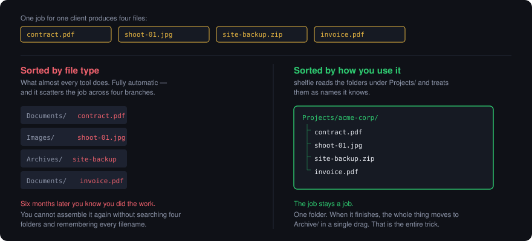
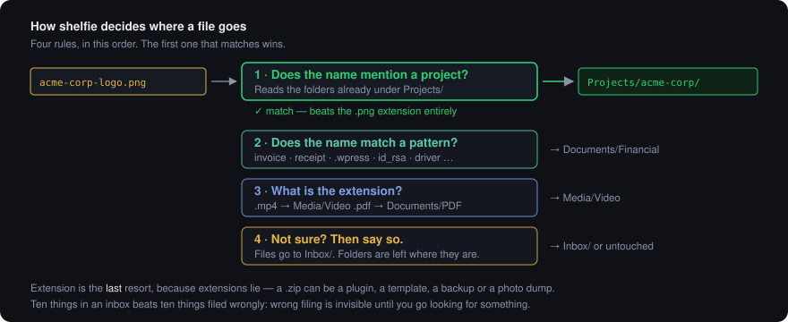

<div align="center">


### Shelve your Downloads folder. One command.

A file organiser that asks how you *work* before it moves anything —
then shows you the plan, waits for a yes, and never deletes.

[](LICENSE)
[](https://python.org)
[](#install)
[](pyproject.toml)
[](CHANGELOG.md)

</div>

---

## Why file organisers get abandoned

<div align="center">
  
</div>

Almost every organiser sorts by extension into `Images`, `Documents`, `Videos`.
It is trivial to automate, which is why it is the default everywhere — and it is
exactly why people stop trusting the result.

**It splits things that belong together.** The contract, the photos, the backup
and the invoice from one job land in four different branches. Six months later
you know you did the work and you cannot assemble it again.

shelfie starts from the other end: **how you use a thing, not what type it is.**

---

## What it looks like

```console
$ shelfie sort

  · library  C:\Library
  · strategy PARA (by how you use it)
  · projects acme-corp, blue-lagoon, northwind

Plan — 14 items, 2.4 GB
──────────────────────────────────────────────
  acme-corp-logo.png            → Projects/acme-corp
  invoice-2026.pdf              → Areas/Finances
  id_rsa                        → Areas/Credentials
  holiday.jpg                   → Resources/Media/Images
  ubuntu-24.04.iso              → Resources/Software/Disk Images
  site-20260101.wpress          → Archive/Site Backups
  random.zip                    → Inbox/Archives

  Left alone (1):
    some-project-folder          no confident match - left alone

  ? Move these now? (y/N)
```

Note `acme-corp-logo.png`. It is a `.png`, but it went to the client folder —
because the *name* mattered more than the extension. That one rule is most of
the value.

---

## How it decides

<div align="center">
  
</div>

**It learns your projects from folders you already made.** Create
`Projects/acme-corp/` and anything mentioning that client routes there, whatever
the file type. Nothing to configure, nothing to maintain.

**It refuses to guess.** No confident match means the file stays put and is
listed as skipped. Ten things in an inbox beats ten things filed wrongly,
because wrong filing is invisible until you go looking.

---

## Install

```bash
pip install shelfie-organizer
```

The command is `shelfie`; the package is `shelfie-organizer` because the shorter
name was already taken on PyPI by an unrelated project.

<details>
<summary>From source</summary>

```bash
git clone https://github.com/mohsankayani/shelfie
cd shelfie
pip install -e .
```
</details>

No dependencies beyond the Python standard library — nothing to break later.

---

## Two minutes to set up

```bash
shelfie
```

First run walks you through five questions, then remembers the answers.
**Nothing is moved during setup.**

| | |
|---|---|
| **1. Which folders get messy?** | Downloads and Desktop are found automatically |
| **2. Where should sorted files go?** | one library folder, created if needed |
| **3. How should it be organised?** | five strategies, each explained with examples |
| **4. How long before a file is "settled"?** | files newer than this are never touched |
| **5. Visual map?** | optional Obsidian graph of your library |

Then:

```bash
shelfie sort         # preview → confirm → file
shelfie sort -n      # preview only, never moves
shelfie undo         # put the last sort back
shelfie where        # your library at a glance
shelfie map          # build an Obsidian graph
```

### `shelfie where`

```console
  Projects           ████████████████████··   81.2 GB    258095 files
  Archive            ██████████············   54.3 GB        24 files
  Media              ██████················   36.5 GB       201 files
  Software           ████··················   26.1 GB      1357 files
  Learning           █·····················    4.7 GB        29 files
```

---

## Pick how you think

There is no correct answer — only the one that matches how you look for things.
The wizard explains each and shows an example.

| Strategy | Shape | Good for | Watch out |
|---|---|---|---|
| **PARA** | `Projects/` `Areas/` `Resources/` `Archive/` | Work that arrives as jobs. Everything for a client together. | Needs a decision: is this still active? |
| **By type** | `Media/Video/` `Documents/PDF/` | Emptying a downloads folder. Zero decisions. | Splits things that belong together. |
| **Type, then year** | `Media/Images/2026/` | The pragmatic middle. Browsable, folders stay small. | One more level to click through. |
| **By date** | `2026/03 March/` | Photos, screenshots, scans — things you place in time. | Hopeless for finding by subject. |
| **Flat** | `Media/` `Documents/` | People who genuinely search instead of browsing. | Folders get very large. |

PARA is [Tiago Forte's](https://fortelabs.com/blog/para/) idea; the numbered
variant is [Johnny.Decimal](https://johnnydecimal.com/). shelfie did not invent
either — it applies one consistently so you do not have to.

---

## Safety

Worth being specific, because this category of tool has a bad reputation.

| | |
|---|---|
| 🚫 **Never deletes** | Only `shutil.move`. No delete path exists in the code. |
| 🚫 **Never overwrites** | Collisions become `name (2).ext`. |
| 👀 **Dry run by default** | `sort` shows a plan and waits. `-n` never moves at all. |
| ↩️ **Reversible** | `shelfie undo` reads a log of the last sort and puts it back. |
| 🤷 **Leaves the ambiguous alone** | Unmatched folders stay exactly where they are. |
| ⏳ **Age threshold** | Files newer than *N* days are not touched. |

That last one matters more than it sounds. Automatic sorting without a delay is
actively hostile — you download an installer, alt-tab, and it has vanished. A
few days' grace means only genuine backlog moves, and the tool stays trustworthy.

Cross-device moves are copy-then-delete. If the copy lands but the delete fails —
common on Windows when something holds a handle — shelfie reports that precisely
rather than as a loss, because your data is safe at the destination.

---

## See it as a graph

```bash
shelfie map
```

Writes an [Obsidian](https://obsidian.md) vault: one note per folder, each
linking to its parent and children. Obsidian's graph view then draws your file
system as a network you can explore. Install the community **3D Graph** plugin
and it becomes three-dimensional.

The mechanism is deliberately unmagical — Obsidian's graph is built from
`[[links]]` between notes, so writing one note per folder with links to its
children *is* the whole implementation.
[How it works, and how to build one by hand →](docs/obsidian.md)

---

## Docs

| | |
|---|---|
| [**The idea behind the shelves**](docs/concepts.md) | why "how you use it" beats "what it is" |
| [**Strategies compared**](docs/strategies.md) | five layouts, honestly assessed |
| [**The Obsidian vault**](docs/obsidian.md) | the graph, and the thirty-second version |
| [**Writing your own rules**](docs/rules.md) | routing is a plain list — add to it |

---

## Contributing

Genuinely welcome, especially:

- **Routing rules for file types I have missed.** [`shelfie/rules.py`](shelfie/rules.py)
  is a plain list — add a pattern, open a PR. This is the easiest useful
  contribution and the one that helps most people.
- **macOS and Linux testing.** Written cross-platform, exercised on Windows.
- **Localised category names.**

Open an issue first for anything large, so nobody wastes an evening.

## Licence

MIT. Do what you like with it.
